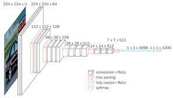

# Deep Image Forgery Detection

An approach to detect image copy-move forgery using deep learning.

ImageNet32-pretrained models of these architectures below: 
* VGGs (VGG16 & VGG19)  

* EfficientNet B0

are fine-tuned on MICC-F2000 copy-move forgery dataset.
